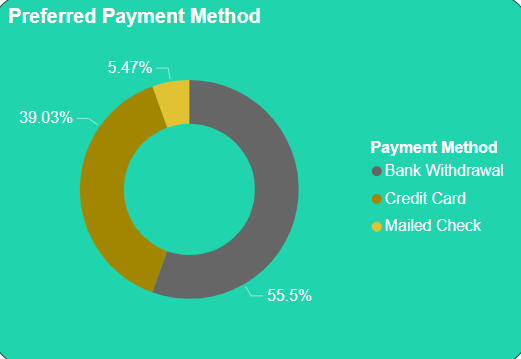

# Customer-Churn-Analysis

# Table of Contents
- [Introduction](#introduction)
- [Business Task](#business-task)
- [Data Source](#data-source)
- [Tools](#tools)
- [Methods](#methods)
- [Codes](#codes)
- [Graphs](#graphs)
- [Summary of Findings](#summary-of-findings)
- [Recommendations](#Recommendations)
- [Limitations](#limitations)
- [Dashboard](#dashboard)
# Introduction 
Customers remain indispensable in any part of an organisation being that the loss of a customer can have adverse effect on the growth of the company. Hence, most organisations evaluate their customer churn rates in order to make predictions and devise strategies to prevent fall outs.
For this project however, an analysis was conducted on churn data for a fictional Telecommunications Company that provides phone and internet services to 7,043 customers in California.
# Business Tasks
1. How many customers joined the company during the last quarter?
2. What is the customer profile for a customer that churned, joined and stayed? Are they different?
3. What seem to be the key drivers of customer churn?
4. Is the company losing high value customers? If so, how can they retain them?
# Data Source
The data was gotten from Maven Analytics Data Playground which is a website where datasets are made available for download in order to practice using real world data for carrying out analysis. The churn data includes details about customer demographics, location, services and current status. It consists of multiple tables, 7043 records and 34 fields stored in a csv file. [Link](https://mavenanalytics.io/data-playground?search=customer%20churn)
# Tools
- Excel
- SQL(MySQL)
- [Power BI](https://app.powerbi.com/view?r=eyJrIjoiZGZjZWZjNzYtODhlMS00MzFiLWIxYTMtMjAyZjllMjc3ZmM4IiwidCI6ImRmODY3OWNkLWE4MGUtNDVkOC05OWFjLWM4M2VkN2ZmOTVhMCJ9)
# Methods
- Loaded the CSV file in Excel for data wrangling
- Checked for duplicates, renamed the columns and and ensured consistent formatting
- Imputed the data in order to eliminate null values
- Imported the data into MySQL to conduct analysis
- Executed queries to extract insights from the data
- Used clauses and functions(such as ALTER TABLE, UPDATE, CASE,etc.) to answer questions related to the business task
- Exported the data into Power BI for visualization and further analysis
- Developed a dashboard for visualising the results using Power BI desktop
# Codes 
Here is a glimpse of the queries constructed to answer questions for the analysis:

```sql
-- What is the overall churn rate of customers --
SELECT Total_Customers, Churned_Customers,
CAST((Churned_Customers * 0.1 /Total_Customers * 0.1 * 100) AS DECIMAL (10,2)) AS Churn_Rate
FROM (SELECT 
		COUNT(*) AS Total_Customers
FROM customer_churn.telecom_customer_churn) AS Total,
	(SELECT COUNT(*) AS Churned_Customers
FROM customer_churn.telecom_customer_churn
		WHERE Customer_Status = 'Churned') AS Churned;
-- Adding an extra column to calculate tenure of customers in years --
ALTER TABLE customer_churn.telecom_customer_churn
ADD Tenure_Range VARCHAR (50);

UPDATE customer_churn.telecom_customer_churn
SET Tenure_Range =
CASE 
	WHEN Tenure < 12 THEN "Less than a year"
    WHEN Tenure = 12 THEN "1 year"
    WHEN Tenure > 12 AND Tenure <= 24 THEN "2 years"
    WHEN Tenure > 24 AND Tenure <= 36 THEN "3 years"
    WHEN Tenure > 36 AND Tenure <= 48 THEN "4 years"
    WHEN Tenure > 48 AND Tenure <= 60 THEN "5 years"
    WHEN Tenure > 60 AND Tenure <= 72 THEN "6 years"
END;
-- What is the typical tenure for churned customers? --
SELECT Tenure_Range,
	COUNT(*) AS Total_Customers,
    SUM(Churn) AS Churned_Customers,
    CAST(SUM(Churn) * 1.0/ COUNT(*) * 100 AS DECIMAL (10,2)) AS Churn_Rate
FROM customer_churn.telecom_customer_churn
GROUP BY Tenure_Range
ORDER BY Churn_Rate DESC;
```
The full code can be viewed [here](Customer_Churn_Analysis.sql)
# Graphs
The following questions were answered and the results are visualized below:
 1. What is the typical tenure for churned customers?


 2. What are the key drivers of customer churn?


 3. Is the company losing high value customers?



